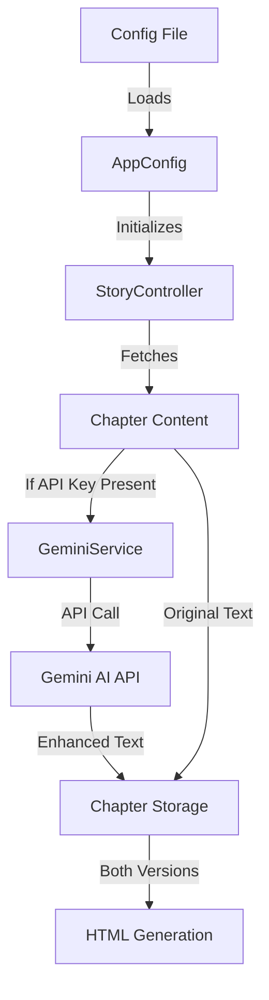

# Design Document

## Overview
This design outlines the integration of Google's Gemini AI API into the TTV app for enhancing translated chapter content. The implementation focuses on configuration-based setup, maintaining both original and enhanced content versions, and providing clear documentation for available models.

## Architecture

### Components and Flow


## Components and Interfaces

### 1. Configuration
```csharp
public class AppConfig
{
    public string UserId { get; set; }
    public string Token { get; set; }
    public string StoryId { get; set; }
    public string OutputFileName { get; set; }
    public int StartChapter { get; set; }
    public int EndChapter { get; set; }
    public GeminiConfig Gemini { get; set; }
}

public class GeminiConfig
{
    public string ApiKey { get; set; }
    public string ModelId { get; set; }
}
```

### 2. GeminiService
```csharp
public interface IGeminiService
{
    Task<string> EnhanceContentAsync(string content);
    IAsyncEnumerable<string> EnhanceContentStreamAsync(string content);
    bool IsConfigured { get; }
}

public class GeminiService : IGeminiService
{
    private readonly string _apiKey;
    private readonly string _modelId;
    private const float Temperature = 0.7f;
    private const float TopP = 0.95f;
    
    public bool IsConfigured => !string.IsNullOrEmpty(_apiKey);
}
```

### 3. Extended ChapterModel
```csharp
public class ChapterModel
{
    // Existing properties...
    public string EnhancedContent { get; set; }
    public bool IsEnhancedWithAI { get; set; }
}
```

## Additional Files

### 1. Available Models (models.json)
```json
{
    "models": [
        {
            "id": "gemini-2.0-flash-lite",
            "apiId": "gemini-2.0-flash-lite",
            "name": "Gemini 2.0 Flash Lite",
            "description": "Phiên bản gọn nhẹ, tối ưu cho tốc độ và chi phí cực thấp...",
            "price": "Giá tham khảo: $0.075/1M token (input), $0.30/1M token (output)"
        }
        // ... other models
    ]
}
```

### 2. Sample Config (config.json)
```json
{
    "userId": "user123",
    "token": "token123",
    "storyId": "story123",
    "outputFileName": "output.html",
    "startChapter": 1,
    "endChapter": 10,
    "gemini": {
        "apiKey": "your-api-key",
        "modelId": "gemini-2.0-flash"
    }
}
```

### 3. Instructions (README.txt)
```text
Hướng dẫn sử dụng:
1. Tạo file config.json theo mẫu
2. Điền thông tin cần thiết
3. Chạy lệnh: TTV.exe config.json

Lưu ý:
- Nếu không cung cấp API key, ứng dụng vẫn hoạt động nhưng không làm mượt nội dung
- Xem models.json để chọn mô hình phù hợp
- Có thể chạy lại để làm mượt các chương bị lỗi
```

## Testing Strategy

### Unit Tests
1. GeminiService Tests
   - Test API key validation
   - Test model configuration
   - Test error handling
   - Mock API responses

2. Integration Tests
   - Test full pipeline from raw content to beautified output
   - Test streaming responses
   - Test error scenarios

### System Requirements
- .NET Core 2.2 (current project version)
- System.Text.Json for JSON handling
- System.Net.Http for API communication

## Performance Considerations
1. Use asynchronous streaming for large content
2. Implement retry mechanism for transient failures
